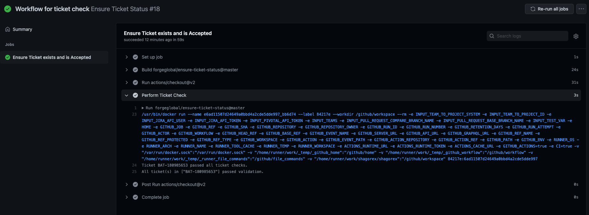
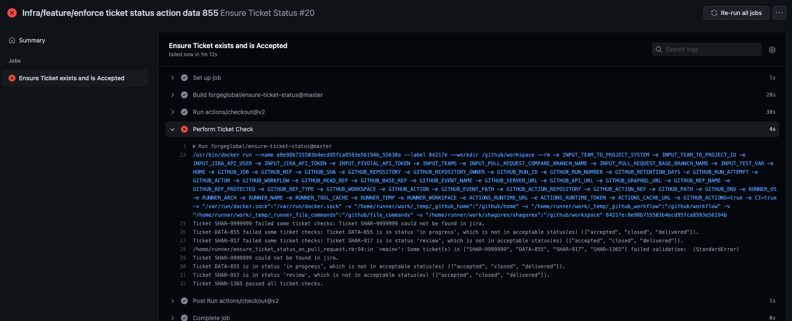

# ensure-ticket-status

Ensures tickets are accepted before allowing merges in pull requests.

# Setup

Use the [workflow template](ensure-ticket-status.yml) and fill out the environment variables under "secrets.*" in your repository secrets.

# How it works

Ticket names are derived from the branch name and commit diff between the base and compare branches. The checkout action in the [workflow template](ensure-ticket-status.yml) is used to ensure we can do git actions on a repo. We need to map a given ticket name in the format of "TEAM-TICKET_ID" i.e. "SHAR-420" to a ticketing system in order to determine which REST Api to use. This is done through the [team_to_project_system](ensure-ticket-status.yml#L9) input variable.

Once we have the ticketing system used it then utilizes the [Jira REST Api](https://developer.atlassian.com/server/jira/platform/rest-apis/) and [Pivotal REST Api](https://www.pivotaltracker.com/help/api#top) to determine if the ticket(s) exist and are in the acceptable states.

# Output

Success looks like this in the Github Action tab:

Failure is aggregated and looks like this in the Github Action tab:

